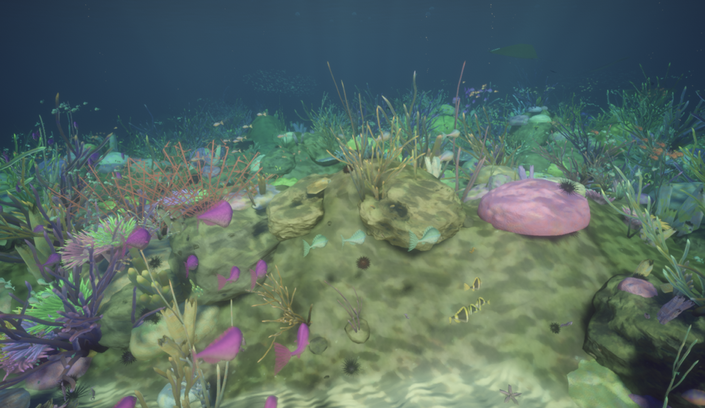

# WebGPU Aquarium

A procedurally generated underwater world rendered with WebGPU. Every run grows a
new reef: terrain, rocks, coral, plants, creatures and fish species are all
generated from a seed, mostly in GPU compute shaders.

[Live](https://greggman.github.io/webgpu-aquarium)

[Development Notes]

## LICENSE: [MIT](LICENSE.md)
